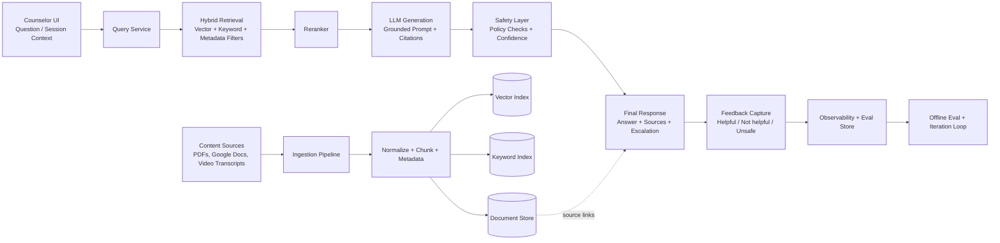

# AI Knowledge Hub - Technical Assessment Answer (krisenchat)

This README is structured to directly answer the two requested tasks.

---

## Task 1 Answer - AI Feature Design (AI Knowledge Hub)

### 1.1 Selected AI Features

#### Feature A: Counselor Copilot (Internal)
- Counselors ask questions during live chats.
- System returns concise guidance, step-by-step support, and source citations.
- Low-confidence or high-risk requests trigger escalation guidance.

#### Feature B: Chatter Exercise Recommender (Counselor-in-the-loop)
- System suggests top 3 resources/exercises from approved materials.
- Recommendations are filtered by language, age range, and risk context.
- Counselor reviews and approves before sending to chatter.

### 1.2 First Architecture (v1)

#### v1 Architecture Diagram

### 1.3 Technical Stack (Recommended)

### Frontend
- `Next.js` + `React` + `TypeScript`
- `Tailwind CSS`
- Internal AI panel integrated into counselor workflow

### Backend/API
- `Node.js` (Next.js API routes or separate service)
- Python microservice optional for retrieval/ML-heavy tasks
- REST endpoints for query, recommendation, feedback, and admin operations

### Data and Search
- Postgres (metadata, logs, feedback)
- Object storage for original assets/transcripts
- Vector DB (e.g., pgvector/Pinecone/Weaviate)
- BM25/keyword index (e.g., OpenSearch/Elasticsearch)

### AI/ML Layer
- Embeddings model for semantic retrieval
- LLM for answer synthesis and recommendation rationale
- Reranker model for top-k evidence quality
- Policy/safety classifier for harmful or unsupported outputs

### Platform and Ops
- Dockerized services
- CI/CD pipeline (GitHub Actions or similar)
- Monitoring: latency, errors, safety events, usage metrics
- Feature flags for gradual rollout

### 1.4 System Design Details (v1)

### Ingestion
- Parse PDF/Docs/Transcript text.
- Clean and split into semantically meaningful chunks.
- Attach metadata:
  - `topic`, `language`, `audience`, `risk_level`, `source_type`, `last_reviewed_at`, `approved=true/false`

### Retrieval and Generation
- Hybrid retrieval:
  - semantic similarity from vector index
  - lexical recall from keyword index
- Metadata constraints:
  - language match
  - approved-only content
  - freshness threshold
- Rerank candidate chunks before generation.
- LLM output contract:
  - must cite evidence chunks
  - must state uncertainty when evidence is weak
  - must avoid unsupported advice

### Safety and Human Controls
- Policy checks on output.
- Confidence gating:
  - high: return directly
  - medium: return with caution note
  - low/high-risk: recommend escalation
- Feature B keeps counselor approval mandatory in v1.

### 1.5 Trade-offs

### Why RAG first (not fine-tuning)
- Pros:
  - fast to ship
  - traceable citations
  - simple content updates
- Cons:
  - quality depends heavily on retrieval quality

### Why transcript-first for videos
- Pros:
  - simpler ingestion pipeline
  - lower implementation risk
- Cons:
  - may miss contextual cues from visuals/audio tone

### Why human-in-the-loop for recommendations
- Pros:
  - safer and better trust in counseling context
- Cons:
  - less automation and slightly slower workflow

### 1.6 Milestones and Timeline (How to Ship)

#### Milestone 0 - Foundations (Estimated: 2-3 weeks)
- Finalize data schema and source approval policy
- Build ingestion MVP for PDFs/Docs/Transcripts
- Create initial metadata taxonomy

#### Milestone 1 - Retrieval MVP (Estimated: 3-4 weeks)
- Deploy vector + keyword indexes
- Implement hybrid retrieval API with metadata filters
- Build basic counselor-side query interface

#### Milestone 2 - Copilot v1 (Estimated: 3-4 weeks)
- Add LLM generation with citation template
- Add safety checks and confidence scoring
- Run internal pilot with a small counselor group

#### Milestone 3 - Recommender v1 (Estimated: 2-3 weeks)
- Add session-tag-based resource recommendation
- Enable counselor approval/edit before send
- Instrument feedback and usage analytics

#### Milestone 4 - Stabilize and Scale (Estimated: 3-5 weeks)
- Tune retrieval/reranking from pilot feedback
- Improve latency and reliability
- Roll out via feature flags to wider cohort

### 1.7 Release Plan

#### Release 0 - Internal Alpha (Estimated duration: 2-3 weeks)
- Audience: engineering + selected counseling leads.
- Goal: validate ingestion quality, retrieval relevance, and safety baseline.
- Exit criteria:
  - stable ingestion pipeline
  - citation rendering works end-to-end
  - no critical safety policy failures in internal test set

#### Release 1 - Counselor Pilot (Estimated duration: 3-4 weeks)
- Audience: small counselor cohort under feature flag.
- Goal: validate real workflow usability and response quality.
- Exit criteria:
  - adoption and feedback collection active
  - hallucination and unsafe output below agreed thresholds
  - confidence/escalation behavior reviewed by domain experts

#### Release 2 - Expanded Beta (Estimated duration: 4-6 weeks)
- Audience: larger counselor cohort, additional topics/languages.
- Goal: scale usage while keeping quality and latency stable.
- Exit criteria:
  - KPI targets trending positively
  - p95 latency within SLO
  - no regression on safety gate metrics

#### Release 3 - General Availability (GA) (Estimated duration: 2-4 weeks)
- Audience: all intended counselors and workflows.
- Goal: full production rollout with continuous monitoring.
- Exit criteria:
  - operational runbooks in place
  - dashboard + alerting coverage complete
  - documented iteration cadence and ownership

### 1.8 How to Measure Success (KPIs)

### Quality and Safety
- Groundedness (claims supported by citations): target `>= 90%`
- Hallucination rate: target `<= 3%`
- Unsafe suggestion rate: target `<= 0.5%`
- Escalation precision on risky cases: target `>= 85%`

### Product Impact
- Counselor adoption (weekly active usage): target `>= 60%` pilot users
- Median knowledge lookup time reduction: target `>= 30%`
- Recommendation acceptance rate (Feature B): target `>= 50%`
- Counselor satisfaction score: target `>= 4.0/5`

### Operational
- p95 response latency: target `<= 2.5s`
- Index freshness SLA: approved updates searchable within `< 24h`
- Service availability: target `>= 99.5%`

---

## Task 2 Answer - Iteration and Evaluation Plan

### 2.1 Situation
- v1 is live, but output quality is inconsistent across use cases.
- Objective: improve reliability and safety without slowing delivery.

### 2.2 Roadmap

#### Phase 1 - Diagnose
- Build error taxonomy:
  - retrieval miss
  - wrong citation
  - unsafe wording
  - stale source
  - irrelevant recommendation
- Create labeled eval set from anonymized real examples.

#### Phase 2 - Retrieval-first improvements
- Improve chunking strategy.
- Strengthen metadata filters.
- Tune reranker and query rewrite.

#### Phase 3 - Generation and safety tuning
- Tighten prompt policy.
- Improve confidence calibration.
- Enhance fallback messages for low-evidence scenarios.

#### Phase 4 - Human feedback learning loop
- Learn from counselor edits/accept/reject patterns.
- Weekly review with domain experts for high-risk failures.

#### Phase 5 - Controlled expansion
- A/B test model and retrieval variants.
- Expand language/topic coverage.
- Consider selective fine-tuning only if RAG plateaus.

### 2.3 Evaluation Framework
- Offline evaluation on a fixed labeled set for groundedness, citation precision, and safety.
- Online evaluation with adoption, latency, override rate, and satisfaction.
- Release gates: do not expand rollout if safety metrics regress.

### 2.4 Risks and Mitigations

- Outdated or conflicting content  
  - Mitigation: source versioning, approval workflow, recency filters

- Over-trust in AI suggestions  
  - Mitigation: confidence labels, escalation guidance, human approval gates

- Inconsistent multilingual quality  
  - Mitigation: language-specific evaluation sets and staged rollout

- Privacy/compliance concerns  
  - Mitigation: data minimization, anonymized logs, role-based access controls

---

## Final Notes (Assessment Fit)

- Product-aware architecture decisions (not just model choice)
- Clear v1 boundary with realistic trade-offs
- Strong safety posture for counseling use cases
- Measurable KPIs and operational readiness
- Practical roadmap for improving inconsistent results

#
